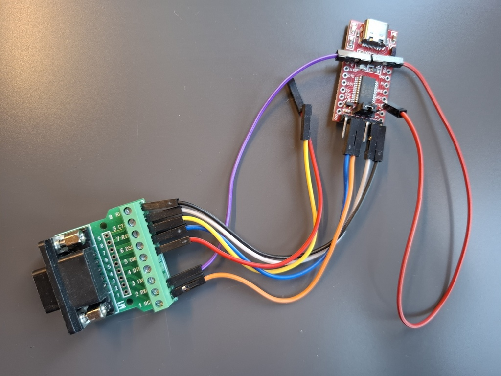

# Joystick serial file transfer for MSX

This project includes:

1. A pinout specification that maps standard RS232 pins (RX, TX, RTS and CTS) to pins of the MSX joystick port.
2. A protocol, similar to [XMODEM](https://en.wikipedia.org/wiki/XMODEM), to transfer files via serial port.
3. An MSX tool to receive files via the joystick port, using the said pinout and protocol.
4. A multiplatform tool (written in C#) to send files via RS232 using the said protocol. Any computer capable of running [the .NET runtime](https://dotnet.microsoft.com/en-us/download/dotnet/8.0) can run this tool.

The goal of this project is to allow for easy transfer of files from a modern computer (any computer capable of running .NET applications), referred to as "PC" in this document, to a MSX using only simple hardware and without having to occupy a cartridge slot, for the purposes of testing MSX applications made with cross-development tools like [Nestor80](https://github.com/Konamiman/Nestor80) or [SDCC](https://sdcc.sourceforge.net/). The opposite (transferring files from the MSX) could of course be achieved by developing the opposite pair of tools.

The MSX tool is built on top of [the msx_softserial project by RvS](https://github.com/rolandvans/msx_softserial), an amazing piece of software engineering that manages to perfectly time the Z80 code to match the chosen transfer speed.


# The pinout

This is the joystick port pinout used by the MSX tool, including the meaning on the MSX side and the connection on the PC side:

|Pin # | MSX side | PC side|
|------|----------|----------|
1 | RX | TX
2 | CTS | RTS
5 | 5V | 5V*
6 | TX | RX
8 | RTS | CTS
9 | GND | GND

_\* Only if the PC requires power to be supplied from the MSX!_

Pin numbers refer to the standard numbering commonly used for DB9 ports (as seen from the computer side):


Here's an example of a homemade cable, on the PC side it uses a [FT232](https://ftdichip.com/products/ft232/) module for communicating via USB port (the computer will see it as a regular serial port) - if you want to make one yourself, note that the 5V pin is **not** connected:




# The protocol

The low-level protocol is standard RS232 with 8 bits per byte, one start and one stop bit, no parity, and [hardware flow control (RTS and CTS)](https://en.wikipedia.org/wiki/RS-232#RTS,_CTS,_and_RTR) in the half-duplex way (sender asserts RTS to signal that data is ready to be sent, receiver in response asserts its own RTS to signal that it's ready to receive the data; note that each RTS is connected to the other side's CTS).

As for the XMODEM-like(ish) software protocol that goes on top of that:

1. The sender sends a header with this structure:

    * File name in 8.3 format, zero terminated (13 bytes)
    * File size in low endian (4 bytes)
    * CRC-16 (with polynomial 0x1021) of the above (2 bytes)

2. The receiver processes the header data, checks the CRC, and sends one status byte. The byte is sent four times to account for possible data corruption, upon reception the sender takes the value that has been received more times (when more than one value has been received the same number of times, the higher value is chosen):

    * 0: Ok.
    * 2: CRC error, the tranmission is aborted.
    * Other: other error, the tranmission is aborted.

3. The sender sends the file contents in chunks of 1024 bytes (the last chunk being possibly smaller), each chunk followed by its calculated CRC-16. There's no sequence number or size indicator for these chunks: data is sent sequentially, and both the sender and the receiver know the exact size of the file and thus how many chunks will be sent (and the size of the last one). The receiver sends one status byte after receiving each chunk (again, four times):

    * 0: Ok.
    * 1: CRC error, the sender will retry sending the same block.
    * Other: other error, the tranmission is aborted.

The sender will abort the transmission after too many CRC errors on the same chunk of data. Low level errors (e.g. failure to receive a proper start or stop bit, or RTS/CTS timeouts) will also abort the tranmission.


# The tools

Based on the above protocol, the following tools are available:


## The MSX file receiver

The program on the MSX side is `JGET.COM`. It allows transmission speeds from 2400 to 57600 bauds, and supports both joystick ports. This is how you run it:

```
JGET <port> <speed> [<file path>]
```

where:

* The port is 1 or 2.
* The speed is: 0 = 2400, 1 = 4800, 2 = 9600, 3 = 19200, 4 = 57600 (bauds/bits per second).
* If the path/name for the received file is omitted, the name in the received header will be used, and the file will be created in the current directory.

Example: `JGET 1 3` (receive file from joystick port 1 at 19200 baud) or `JGET 1 3 file.ext` (same, but name the received file `file.ext`).

The 57600 bauds speed is bit unstable and can fail occasionally.

**Important!** The code for the RS232-compatible part is timed very precisely for the chosen transmission speed, and assumes a clock frequency of 3.57MHz for the Z80 CPU. On MSX Turbo-R computers (and on other computers having the GETCPU and CHGCPU routines in BIOS) the program will switch the CPU to 3.57MHz mode automatically before each data chunk/status byte transmission; for other computers wih turbo CPU capabilities (computers with a 7MHz kit, the SX|2, the Tides Rider, etc) the 3.57MHz mode must be selected manually before running the tool.


## The PC file sender

The program on the PC side is `jsend.exe`, it allows sending files via the joystick port and this is how you use it:

```
jsend <file> <port> <bauds> [/f:<filename to send>]
```

where:

* `<file>` is the path of the file to send. The file name must conform to the 8.3 format supported by the MSX, unless you specify a different name in the `<filename to send>` parameter.
* `<port>` is the system name of the serial port to use.
* `<speed>` is the transmission speed to use in bauds.
* `<filename to send>` indicates the filename to send in the header (by default it's the real file name), must conform to the 8.3 format supported by the MSX.

Example: `jsend somedir/file.ext com5 19200`. Or `jsend somedir/too_long_name.extension com5 19200 /f:file.ext`. In both cases the file name sent in the header will be `FILE.EXT`.

Several variants of this tool are provided for different platforms and .NET runtime handling, choose the one best suited for your system and your preference:

* The "Framework dependant" and "Portable" variants require [the .NET 8 runtime](https://dotnet.microsoft.com/en-us/download/dotnet/8.0) to be installed. 
* The "Standalone" variants don't require the .NET runtime to be installed, but they are much bigger in size (about 60MB vs about 400KB for the framework dependand variants).
* You'll need the "Portable" variant if your system supports .NET 8 but there isn't a a native variant (standalone or framework dependant) available. To run this variant the `dotnet` tool (installed as part of the .NET runtime) needs to be used as follows: `dotnet jsend.exe <arguments>`. Otherwise this variant works exactly like the native ones.


## Running the tools togehter

Simply connect both ends of the cable, then run the MSX tool and the PC tool with matching arguments for the transmission speed. It doesn't matter which one you run first, the RTS/CTS flow control will take care of the synchronization, and each tool will wait a few seconds for the other one before deciding that a timeout has occurred and terminating the transmission.


## Building the tools

### The MSX file receiver

To build the MSX file receiver you need:

* [Nestor80](https://github.com/konamiman/Nestor80/releases), version 1.3 or newer; you only need N80 (so not LK80 nor LB80).
* [SDCC](https://sdcc.sourceforge.net/), version 4.0 or newer.
* `objcopy`, which is part of [the binutils package](https://www.gnu.org/software/binutils/). To install in Ubuntu: `sudo apt-get install binutils`.

These are the commands to build `JSEND.COM` (from within the `msx` directory):

```
N80 serial_slow.asm
N80 serial57k.asm
sdcc --code-loc 0x180 --data-loc 0 -mz80 --disable-warning 85 --disable-warning 196 --no-std-crt0 crt0_msxdos_advanced.rel serial_slow.REL serial57k.REL jget.c
objcopy -I ihex -O binary jget.ihx JGET.COM
```

By the way, the source of `crt0_msxdos_advanced.rel` is [here](https://github.com/Konamiman/Nextor/blob/v2.1/source/tools/C/crt0_msxdos_advanced.s).

If you are in Windows you can use [hexdump](https://www.di-mgt.com.au/hexdump-for-windows.html) in place of `objcopy` like this: `hex2bin -e com jget.ihx`.


### The PC file sender

In Windows you can build the tool directly from [Visual Studio](https://visualstudio.microsoft.com/). In Linux you need to install [the .NET 8 SDK](https://dotnet.microsoft.com/en-us/download/dotnet/8.0), then you can:

* Run the `dotNet/build.sh` script, it will generate the binaries in subdirectories of `dotNet/Release`.
* Then optionally run the `dotNet/zip.sh` script to generate zip files for all the platform specific variants (the same ones that you'll find in [the releases page](https://github.com/konamiman/JoySerTrans/releases)) in `dotNet/Release/zips`.

By default `build.sh` builds all the variants, but you can choose to build only specific ones (e.g. self-contained for Windows) by using environment variables (w.g. `RUNTIMES="win-x64 win-x86" BUILD_TYPES=SelfContained ./build.sh`), see the source of the script for the details.


## Last but certainly not least

I hope that this tool is useful for you. On a completely unrelated and random note, and just in case you feel generous, [my PayPal is open](https://www.paypal.com/cgi-bin/webscr?cmd=_donations&business=konamiman@konamiman.com&item_name=Donation+to+Konamiman+for+JoySerTrans), just sayin'.